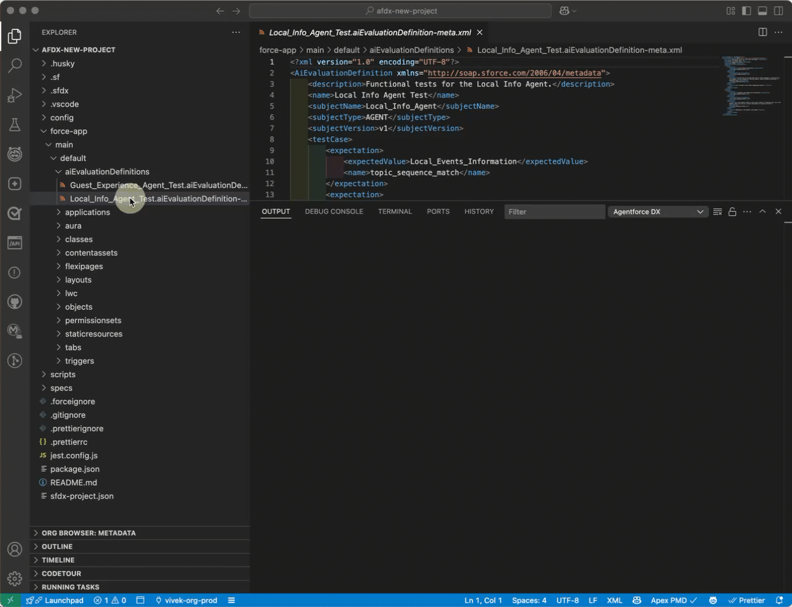
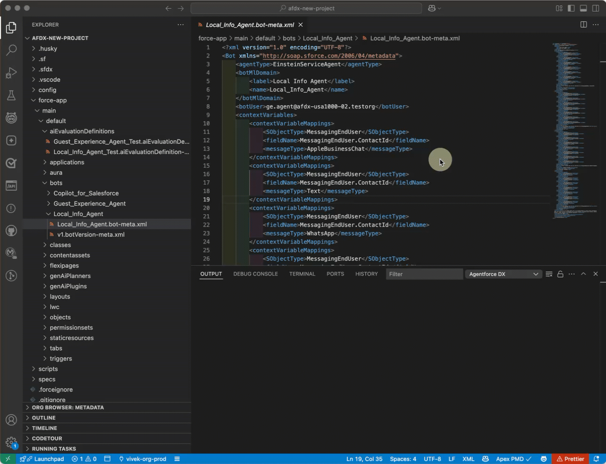

# Agentforce DX for Visual Studio Code

Agentforce DX is a suite of tools to build, preview, and test agents. This extension provides integrated VS Code commands to easily open an agent in your org's Agent Builder UI and run the tests associated with an agent in the Agent Testing Panel.

## Prerequisites

1. Install the [Salesforce Extension Pack and Salesforce CLI](https://developer.salesforce.com/docs/platform/sfvscode-extensions/guide/install.html).
2. The Agentforce DX CLI plugin is JIT, which means it's automatically installed the first time you run an `agent` CLI command. But you can also install the plugin manually by running this command from VS Code's integrated terminal:

   ```bash
   sf plugins install agent
   ```

## How to Use this Extension

1. Run agent tests by viewing them in the Agent Testing Panel. Click on either a test definition or test case to get more information about it.

   

2. Open an agent in the Agent Builder UI of your org by running the **SFDX: Open Agent in Default Org** command from the command palette. You can also run the same command by right-clicking any of these metadata components in your DX project package directory:

   - Bot (file extension `.bot-meta.xml`)
   - BotVersion (file extension `.botVersion-meta.xml`)
   - GenAiPlanner (file extension `.genAiPlannerBundle-meta.xml`)
   - GenAiDefinition (file extension `.genAiDefinition-meta.xml`)

   

## Documentation

For information about Agentforce DX, see the **Build Agents with Agentforce DX** section of the [Agentforce Developer Guide](https://developer.salesforce.com/docs/einstein/genai/guide/agent-dx.html).

## Bugs and Feedback

To report issues with this Agentforce DX extension, open a bug on [GitHub](https://github.com/forcedotcom/cli/issues). To suggest a new feature, start a [GitHub discussion](https://github.com/forcedotcom/cli/discussions).
