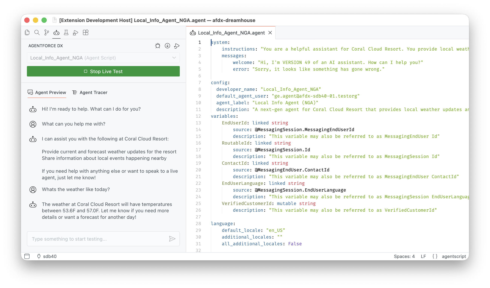
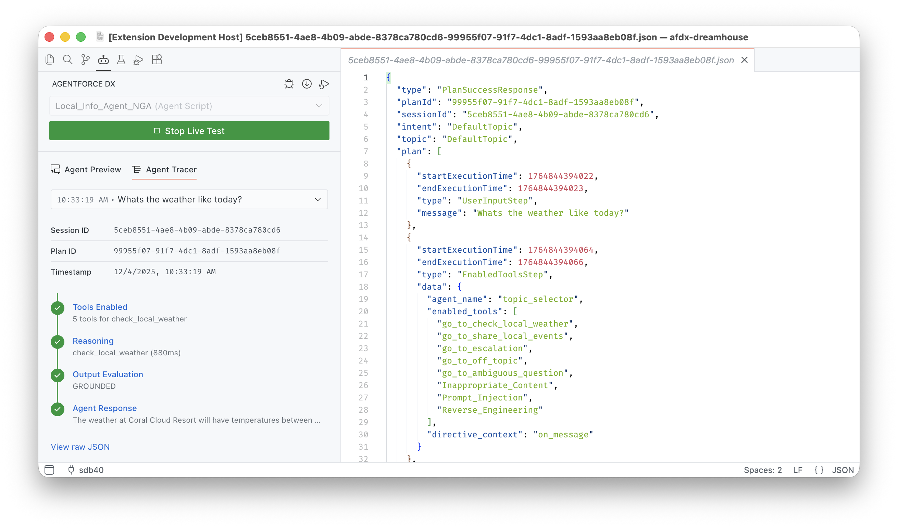
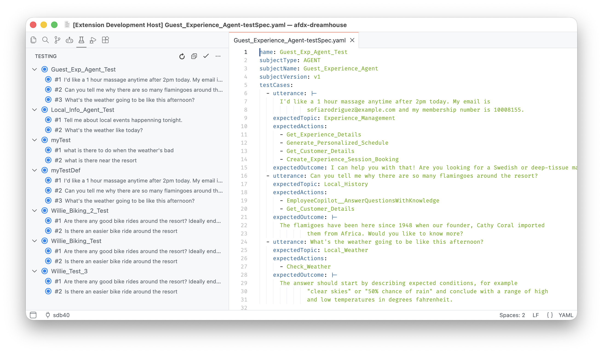

# Agentforce DX for Visual Studio Code

Agentforce DX brings powerful agent development capabilities directly into Visual Studio Code. Build, preview, test, and debug Salesforce agents with an integrated development experience that includes:

- **Interactive Preview**: Chat with your agents to test their responses and behavior.
- **Conversation Tracer**: Deep-dive into how your agent processes requests, makes decisions, and executes actions. 
- **Integrated Testing**: Run and manage agent test suites with full visibility into test results. 
- **Agent Management**: Open agents in Agent Builder and activate/deactivate them directly from VS Code. 

## Prerequisites

1. Install the [Salesforce Extension Pack and Salesforce CLI](https://developer.salesforce.com/docs/platform/sfvscode-extensions/guide/install.html).
2. The Agentforce DX CLI plugin is JIT, which means it's automatically installed the first time you run an `agent` CLI command. But you can also install the plugin manually by running this command from VS Code's integrated terminal:

   ```bash
   sf plugins install agent
   ```

## How to Use this Extension

Here are the high-level features of this extension:

- [Preview Agents](README.md#preview-agents)
- [Trace Agent Conversations](README.md#trace-agent-conversations)
- [Test Agents](README.md#test-agents)

### Preview Agents

Chat with your agents directly in VS Code to test how they respond to user inputs. The Agent Preview panel lets you have interactive conversations with agents using their Agent Script file or with active agents in your org. Previewing agents helps you validate their behavior before deployment.

You can use these two modes when previewing an agent from its Agent Script file:

- Simulated mode : Uses only the Agent Script file to converse, and it simulates (or mocks) all the actions. This mode is particularly useful if the Apex classes, flows, or prompt templates that implement the actions aren't yet available. 
- Live mode : Uses the actual Apex classes, flows, and prompt templates in your development org in the agent preview.  You can use the Apex Replay Debugger to debug your Apex classes when using live mode.

See [Preview and Debug an Agent](https://developer.salesforce.com/docs/einstein/genai/guide/agent-dx-nga-preview.html) for details. 



### Trace Agent Conversations

Understand exactly how your agent processes each conversation with the built-in Conversation Tracer. The tracer provides a detailed, step-by-step view of the agent's decision-making process, including:

- How the agent interprets user utterances.
- Which actions the agent selects and why.
- API calls and data transformations.
- Response generation and output formatting.

Use the tracer to troubleshoot unexpected behavior, optimize agent performance, and gain insights into your agent's reasoning.



### Test Agents

Run and manage your agent test suites from the Agent Testing Panel. View test definitions and individual test cases, run tests with a single click, and get detailed results for each test execution. The testing panel integrates with VS Code's native testing UI, providing a familiar experience for running and debugging agent tests.

See [Test an Agent](https://developer.salesforce.com/docs/einstein/genai/guide/agent-dx-test.html) for details. 



## Documentation

For details about the features in this VS Code extension, and generally more information about Agentforce DX, see the **Build Agents with Agentforce DX** section of the [Agentforce Developer Guide](https://developer.salesforce.com/docs/einstein/genai/guide/agent-dx.html).

## Bugs and Feedback

To report issues with this Agentforce DX extension, open a bug on [GitHub](https://github.com/forcedotcom/cli/issues). To suggest a new feature, start a [GitHub discussion](https://github.com/forcedotcom/cli/discussions).
